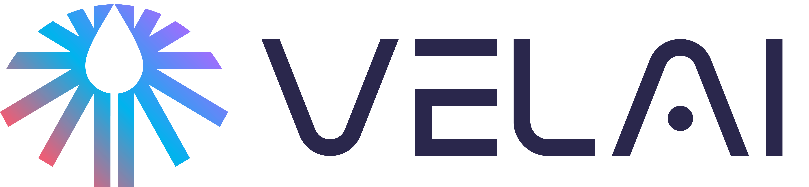

# VelAI — SRE CoPilot

VelAI is an AI-powered SRE platform that automates incident response end to end: it
ingests alerts, joins incident conversations and bridge calls, transcribes and
summarizes what happened, extracts action items, and keeps stakeholders informed —
all running inside your own Kubernetes cluster.

This repository contains the **VelAI Helm chart** ([charts/velai](charts/velai)),
which deploys the platform: **Admin Console + Orchestrator + On-call agent**.

> Looking for the earlier n8n-based on-call workflow? It is preserved at the
> [`n8n-release-1.0`](../../tree/n8n-release-1.0) tag.

## 🏗️ Architecture

```
 ┌──────────────┐   ┌───────────────┐   ┌────────────────┐
 │ Monitoring / │   │ Slack threads │   │ Incident bridge│
 │ Alert sources│   │ & mentions    │   │ calls          │
 └──────┬───────┘   └──────┬────────┘   └───────┬────────┘
        │ webhooks         │ events             │ audio
        └──────────────┬───┴────────────────────┘
                       ▼
        ┌─────────────────────────────┐
        │        Orchestrator          │  routes work, manages the
        │  (agent routing + queueing)  │  agent task queue (Redis)
        └──────────────┬──────────────┘
                       ▼
        ┌─────────────────────────────┐
        │        On-call agent         │
        │  • alert triage & context    │
        │  • thread participation      │
        │  • LLM transcription of      │
        │    bridge-call audio         │
        │  • LLM summaries & action    │
        │    items on a schedule       │
        └──────────────┬──────────────┘
                       │ draft summaries
                       ▼
        ┌─────────────────────────────┐
        │        Admin Console         │  review/approve, agent config,
        │  (web UI + approval flow)    │  licence & health dashboard
        └──────────────┬──────────────┘
                       ▼
              publish to stakeholder
              channels (Slack, etc.)

  Shared services: Redis (queue + recent history) · PostgreSQL (durable
  chat/incident history) · External Secrets Operator (agent config sync
  from AWS/Azure/GCP/OCI/Vault)
```

## 🧩 Components

### Admin Console
The web UI for operating VelAI:
- Agent health and licence status dashboard
- Agent configuration (LLM provider keys, Slack/Jira tokens, MCP credentials),
  stored in your chosen secret backend — AWS, Azure Key Vault, GCP Secret
  Manager, OCI Vault, or HashiCorp Vault — and synced to the agents via
  External Secrets Operator
- Local admin login or SSO via generic OIDC (Google, JumpCloud, Okta, …)
- Review-and-approve queue for agent-generated summaries before publication
- Optional licence-gated auto-refresh of the image pull secret

### Orchestrator
The coordination layer between agents:
- Receives inbound work (alert webhooks, Slack events) and routes it to the
  right agent
- Manages the task queue and recent-context store (Redis)
- Persists durable chat and incident history (PostgreSQL)

### On-call agent
The incident responder:
- **Alert intake** — receives and triages alert webhooks from monitoring
  systems (PagerDuty, Grafana, Prometheus, …)
- **Slack participation** — joins incident threads when mentioned and tracks
  the conversation in real time
- **Transcription** — an LLM-based speech-to-text pipeline transcribes
  incident bridge calls so nothing said on the call is lost
- **Summarization** — an LLM generates periodic incident summaries (progress,
  key decisions, current status, next steps) from thread messages and call
  transcripts, at a configurable interval
- **Action items** — continuously extracts and tracks action items from the
  discussion
- **Review workflow** — sends draft summaries to the Admin Console for
  approval, then publishes to stakeholder channels

## 🚀 Deployment

VelAI runs in your Kubernetes cluster and is installed with Helm:

```bash
helm repo add velai https://guhatek-saas.github.io/velai-oss
helm repo update
helm install velai velai/velai -n velai --create-namespace -f my-values.yaml
```

You need a VelAI licence bundle and pull access to the VelAI images. The full
install flow — required secrets, image pull options, secret backends, SSO,
in-cluster vs. external Postgres — is in the
[chart README](charts/velai/README.md).

## 📋 Prerequisites

- Kubernetes 1.24+ and Helm 3.8+
- A VelAI licence bundle (tenant slug, licence URL, tenant key, CA cert)
- Pull access to the VelAI container images
- Slack workspace admin access (to create the bot the on-call agent uses)
- An LLM provider API key (configured from the Admin Console)

## 🔒 Security

- The chart ships **no secrets and no application code** — only Kubernetes
  manifests; you provide the images and pre-created Secrets
- Agent credentials live in your cloud secret backend, synced by External
  Secrets Operator; nothing sensitive is stored in values files
- Registry credentials can be short-lived and licence-gated via the pull-secret
  auto-refresh, so no long-lived token sits in your cluster
- Summaries go through an admin approval step before reaching a wider audience

## 🤝 Contributing

1. Fork the repository
2. Create a feature branch: `git checkout -b feature/new-feature`
3. Commit your changes: `git commit -am 'Add new feature'`
4. Push to the branch: `git push origin feature/new-feature`
5. Submit a pull request

## 📝 License

This project is licensed under the Apache License 2.0 — see the
[LICENSE](LICENSE) file for details.

## 💬 Support

For issues and questions:
- Open an issue on GitHub
- Join our community Slack channel
